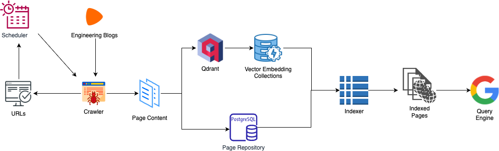

#

## Project Architecture

- **Crawler**: 
  - Begins the process by discovering new and updated web pages.
  - Visits web pages by following links to add them to the search engine index.

- **Scheduler**: 
  - Determines the priority of URLs discovered by the crawler.
  - Prioritization is based on page change frequency, importance, and crawl policies.

- **Qdrant**: 
  - Qdrant is a vector search engine optimized for storing and querying large collections of vector embeddings.

- **Embeddings Collections**: 
  - Each web page or document in the Page Repository would have a corresponding vector in the Embeddings Collections, representing the semantic essence of that page's content.
  - These embeddings are used for performing similarity searches, which can return results based on the content's meaning rather than just keyword matching.

- **Page Repository**: 
  - Stores crawled pages.
  - Acts as a large database of the web's content.

- **Indexer**: 
  - Takes parsed information to create search index entries.
  - Organizes data for quick retrieval by keywords or search terms.

- **Query Engine**: 
  - Activates when a user inputs a query.
  - Searches the indexed pages to find the most relevant results.

## Database Performance Comparison

| Description | DB without Indexing | DB with Indexing | Vector Embeddings |
|-------------|---------------------|------------------|-------------------|
| **Response Time** | | | |
| `select id from post_content where tags = 'AWS';` | Planning Time: 0.131 ms Execution Time: 0.176 ms | Planning Time: 0.378 ms Execution Time: 0.042 ms | Response Time: 1383.56 ms |
| `select id from post_content where tags like '%AWS%';` | Planning Time: 0.193 ms Execution Time: 0.707 ms | Planning Time: 0.177 ms Execution Time: 0.226 ms | Response Time: 700.56 ms |
| **Relevance Scoring** | | | |
| `select id from post_content where tags like '%cloud infrastructure%';` | id ---- (0 rows) | id ---- (0 rows) | Response Time: 41.86 ms |

---

This table provides a comparative overview of the performance metrics across different database configurations and vector embeddings. The "DB without Indexing" and "DB with Indexing" columns show the planning and execution times for queries run against a PostgreSQL database, both with and without indexing. The "Vector Embeddings" column presents response times for similar queries executed using a neural search engine. As illustrated, indexing significantly improves query performance in traditional databases, whereas vector embeddings, despite their higher response times, offer advanced search capabilities through semantic understanding of the query content. This evaluation helps in understanding the trade-offs between query execution efficiency and the quality of search results.

## Visualization of Vector Embeddings

The visualization produced by the script displays a UMAP projection of content vector embeddings derived from blog posts. Each point in the plot represents a blog post, with its position determined by the UMAP reduction of its high-dimensional vector embedding to two dimensions. The colors indicate different tags associated with each post, providing an intuitive understanding of how posts with similar content and context are clustered together.

This plot is particularly useful for identifying patterns and relationships between posts based on their content similarities. For instance, closely clustered points suggest posts with similar themes or subjects, while distinct clusters could indicate different categories or topics covered by the posts. The use of UMAP for dimensionality reduction helps in capturing both local and global structures of the data, making it easier to visualize the semantic landscape of the blog's content.

By examining this visualization, we can gain insights into the diversity of the content, how well different topics are covered, and potential areas where the content might be overlapping or lacking. This can inform content strategy decisions, such as identifying new topics to explore or recognizing areas with dense coverage that might benefit from further diversification.
